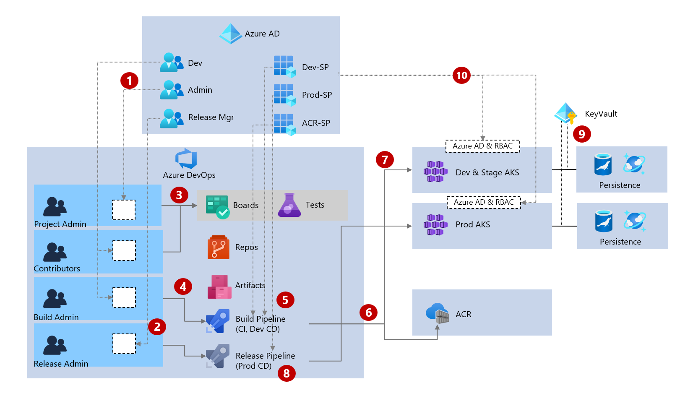

RBAC without AKS itself role

# Azure DevOps(ADO) Governance

SDLC를 위한 권한, 보안, 통제 정책을 중앙집중적으로 관리

* Azure AD: Azure AD 사용자, 그룹
* Organization: Team, Azur AD 그룹
* 프로젝트: 보드, 리파지토리, 파이프라인, 아티팩트, 테스트관리

## 예시 아키텍처
Azure AD와 ADO를 연계관리하고 보드 권한통제, CI/CD 파이프라인 통제, 클러스터 연계등을 구현

> 공식 예시 아키텍처는 https://docs.microsoft.com/ko-kr/azure/architecture/example-scenario/governance/end-to-end-governance-in-azure#architecture 참고

1. Azure AD에서 개발자그룹, 어드민, 릴리즈 매니저 그룹을 생성. 사용자 할당

    > 개발자그룹 내 SRE를 포함한다고 가정

2. Azure AD그룹을 ADO 그룹에 매핑함. 전체 ADO 기본 그룹은 [링크](https://docs.microsoft.com/ko-kr/azure/devops/organizations/security/about-permissions?view=azure-devops&tabs=preview-page#default-security-groups) 참고 

3. Azure Boards와 테스트관리에 ADO그룹을 이용하여 Permission을 설정할 수 있음.
기본 권한은 [링크](https://docs.microsoft.com/ko-kr/azure/devops/organizations/security/permissions-access?view=azure-devops#azure-boards)와 같으나 상세 Permission을 워크플로우화 하여 정의할 수 있음.
    * 사용자 정의 비즈니스 워크플로우 정의 참고: https://docs.microsoft.com/ko-kr/azure/devops/organizations/security/set-permissions-access-work-tracking?view=azure-devops#support-business-workflows-through-custom-rules
  
4. ADO의 빌드 Admin만 빌드 파이프라인을 관리할 수 있음. 다만, 빌드 파이프라인을 yaml로 관리하고 리파지토리 커밋에 의한 자동 CI는 리파지토리 권한에 의해 실행될 수 있음.

    > CI와 개발계 배포 파이프라인은 리파지토리의 태깅 푸시에 의해 빌드파이프라인에서 처리되도록 설정하여 개발팀 자율적으로 배포할 수 있게 설정할 수 있음. 아래 sample yaml참고
 
    ```yaml
    # 트리거부문 
    trigger:
    tags:
        include:
        - '*'
    branches:  
        include:
        - '*'
    ...
    # 특정 태깅에 따른 개발계 배포
    - stage: Deploy
      displayName: Deploy stage
      dependsOn: Build
      condition: OR(contains(variables['build.sourceBranch'], 'RC'), contains(variables['build.sourceBranch'], 'RELEASE'))

      jobs:
      - deployment: Deploy
    ...
    ```

5. ADO와 Azure의 서비스는 Service Principal(SP)를 이용하여 서비스 연계

    빌드나 릴리즈 파이프라인에서 AKS 배포를 위한 연계는 Azure AD에서 생성해놓은 SP를 사용. SP는 배포를 위해 클러스터의 `Contributor`의 권한을 가지고 있어야 함.

6. 빌드 파이프라인에서 ACR로 이미지를 Push할 경우에도 `Dev-SP`를 이용하여 연계후 RBAC통제

7. 빌드 파이프라인 및 개발계 배포 CD에서 앱 배포시 `Dev-SP` 사용

8. 릴리즈 파이프라인에서 운영계 배포시 별도의 `Prod-SP` 사용

9. 클러스터에서 Persistence 연결 시 비밀 정보는 KeyVault로 중앙집중 관리

10. 클러스터와 Azure AD를 연계하여 RBAC통제

|종류|특징|가이드|
|---|---|---|
|Azure AD와 K8S RBAC|클러스터가 복합적이며 네임스페이셔 별 복잡한 Role관리 필요시, K8S 표준 RBAC 요구시|[가이드](https://docs.microsoft.com/ko-kr/azure/aks/manage-azure-rbac)|
|Azure AD와 AKS RBAC|클러스터 내 Role 구조가 단순 단순|[가이드](https://docs.microsoft.com/ko-kr/azure/aks/azure-ad-rbac)|


## ADO와 Azure AD 통합
Azure AD와 ADO를 연계하여 관리
1. Organization을 Azure 에 연결: https://docs.microsoft.com/ko-kr/azure/devops/organizations/accounts/connect-organization-to-azure-ad?view=azure-devops

2. Azure AD에 사용자 추가: https://docs.microsoft.com/ko-kr/azure/active-directory/fundamentals/add-users-azure-active-directory

3. ADO 그룹에 Azure AD그룹 추가: https://docs.microsoft.com/ko-kr/azure/devops/organizations/accounts/manage-azure-active-directory-groups?view=azure-devops

4. ADO에서 권한 할당은 그룹 단위로 설정할 것을 권고: https://docs.microsoft.com/ko-kr/azure/devops/organizations/accounts/assign-access-levels-by-group-membership?view=azure-devops&tabs=preview-page

## 프로젝트

* 개발 운영 프로젝트 단위로 생성하되 프로젝트 내에서 사용하는 보드, 리파지토리, 파이프라인 등이 전부 포함되도록 구성하는 것을 권고.
* 개괄적인 ADO 프로젝트 구성에 대한 문서는 [여기](https://docs.microsoft.com/ko-kr/azure/devops/user-guide/plan-your-azure-devops-org-structure?toc=%2Fazure%2Fdevops%2Fsecurity-access-billing%2Ftoc.json&bc=%2Fazure%2Fdevops%2Fsecurity-access-billing%2Fbreadcrumb%2Ftoc.json&view=azure-devops) 참고

## 보드

* 사용자 정의 워크플로우를 생성하여 백로그의 상태를 통제할 수 있음.
* 특정 사용자만 백로그의 상태 변경등을 통제할 수 있음
* 커스텀 프로세스 만들기: https://docs.microsoft.com/ko-kr/azure/devops/organizations/settings/work/manage-process?view=azure-devops
* 워크플로우 사용자 지정: https://docs.microsoft.com/ko-kr/azure/devops/organizations/settings/work/customize-process-workflow?toc=%2Fazure%2Fdevops%2Freference%2Ftoc.json&bc=%2Fazure%2Fdevops%2Freference%2Fbreadcrumb%2Ftoc.json&view=azure-devops
* 상태전환 제한: https://docs.microsoft.com/ko-kr/azure/devops/organizations/settings/work/rule-samples?view=azure-devops&tabs=inheritance#restrict-state-transitions
* 사용자 또는 그룹에 따라 제한: https://docs.microsoft.com/ko-kr/azure/devops/organizations/settings/work/custom-rules?view=azure-devops#add-a-custom-rule


> Jira도 마찬가지이지만 워크플로우나 백로그의 변경이력이 전부 누적되서 저장되기 때문에에 별도의 통제 없이 정책적으로만 가이드하는 경우도 있음.

## 리파지토리

### 리파지토리 전략

* 프로젝트 내 다수 리파지토리. Github이나 Azure Git사용
* 특정 브랜치 (예: `main`이나 `master`)를 Protected브랜치로 통제할 수 있음. 개발자가 바로 커밋할 수 없고 Pull Request를 통해 관리자의 승인 후에만 반영.
* 개발자는 항상 `feature`브랜치에서 작업하도록 권고
* 리파지토리를 코드 프로젝트 단위 별로 운영

### 브랜치 전략

* 다양한 브랜치 전략이 있으나 너무 복잡한 전략 (Git-flow)은 피하는게 좋음.
* GitHub flow나 Gitlab flow 활용가능
* GitHub Flow를 기반으로 Git-flow의 릴리즈 전략을 Addon한 방식 권고
  [링크](README.md#cicd-pipelineing을-위한-git-branch-전략)

### 파이프라인
* 파이프라인 예시: [링크](README.md#목표-cicd-파이프라인)
* Azure 리소스를 위한 레퍼런스 아키텍처: https://docs.microsoft.com/ko-kr/azure/architecture/example-scenario/governance/end-to-end-governance-in-azure#architecture

### Azure 서비스 연계
Service Principal(SP)로 AKS, ACR연계. SP는 Azure AD에서 RBAC관리. AKS 및 ACR에 `Contributor` 할당
* 서비스 연결관리: https://docs.microsoft.com/ko-kr/azure/devops/pipelines/library/service-endpoints?view=azure-devops&tabs=yaml
* Service Principal을 통해 연결 AKS연결:
  1. 자동화된 연결: https://docs.microsoft.com/ko-kr/azure/devops/pipelines/library/connect-to-azure?view=azure-devops#create-an-azure-resource-manager-service-connection-using-automated-security
   >단, SP 사용 시 secret만료 때마다 항상 갱신해주어야 함. 위 자동화된 연결을 통해 SP생성 시 secret의 유효기간은 2년이므로 만료되기전 갱신해야 합니다. **연결을 편집하고 확인하여 저장하면 갱신됩니다.**
  2. 기존 생성된 SP 연결:  https://docs.microsoft.com/ko-kr/azure/devops/pipelines/library/connect-to-azure?view=azure-devops#create-an-azure-resource-manager-service-connection-with-an-existing-service-principal
* ACR도 SP를 통해 ADO와 연결: https://docs.microsoft.com/en-us/azure/devops/pipelines/ecosystems/containers/acr-template?view=azure-devops
### 빌드 파이프라인
* Pull Request나 Commit시 수행되도록 설정
* ACR에 이미지 배포
* 개발계는 리파지토리 태깅으로 트리거링 되어 배포할 수 있도록 설정가능.
### 릴리즈 파이프라인

* 운영계는 관리자 승인이 있어야 진행되도록 워크플로우 화. 아래 예시처럼 승인과정을 넣어 Release Manager에 승인이 필요하도록 설정가능
  * 가이드: https://docs.microsoft.com/ko-kr/azure/devops/pipelines/release/approvals/approvals?view=azure-devops
  * 예시 워크플로우
    
* 릴리즈 파이프라인 설계 샘플은 아래 참고
  * [릴리즈 파이프라인](release-pipeline.md)
* 운영 배포 실패시 바로 롤백할 수 있는 메커니즘 필요
    Helm Chart로 구성 시 Rollback 및 히스토리 관리가 매우 용이. 위 릴리즈 파이프라인 문서 내 롤백 참고

## DevOps Starter를 통한 구성

DevOps Starter를 통해 AKS에 앱이 CI/CD를 통해 배포되는 과정을 테스트해볼 수 있음

* DevOps Starter 실습: https://docs.microsoft.com/ko-kr/azure/devops-project/azure-devops-project-aks)
* 혹은 본 프로젝트의 [README](README.md)를 통해 실습할 수 있음.

## Azure DevOps 거버넌스 데모 : https://github.com/azure/devops-governance