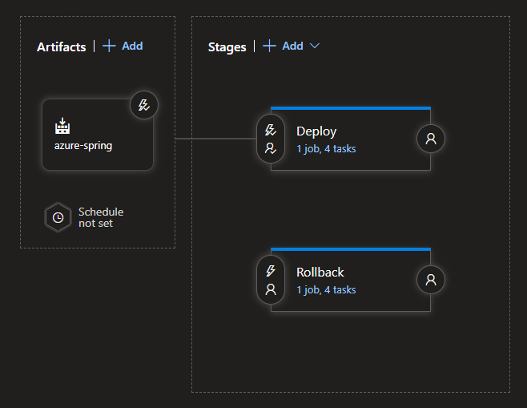
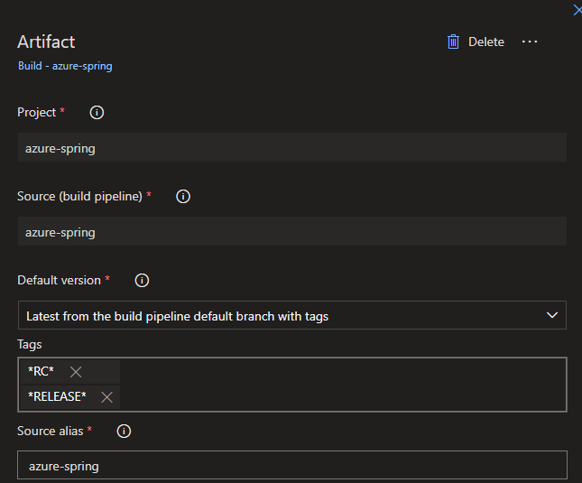
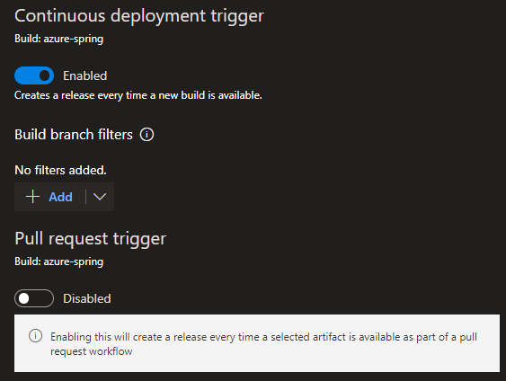
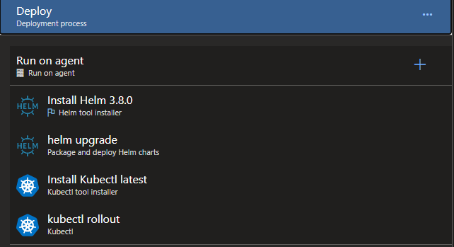
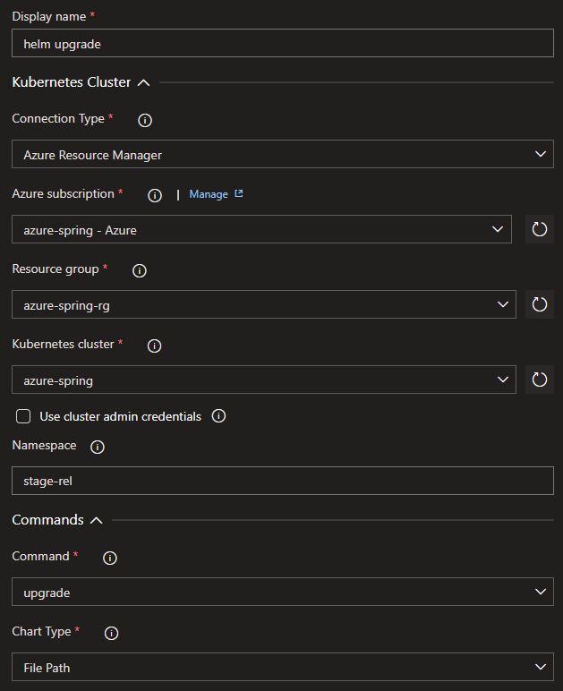
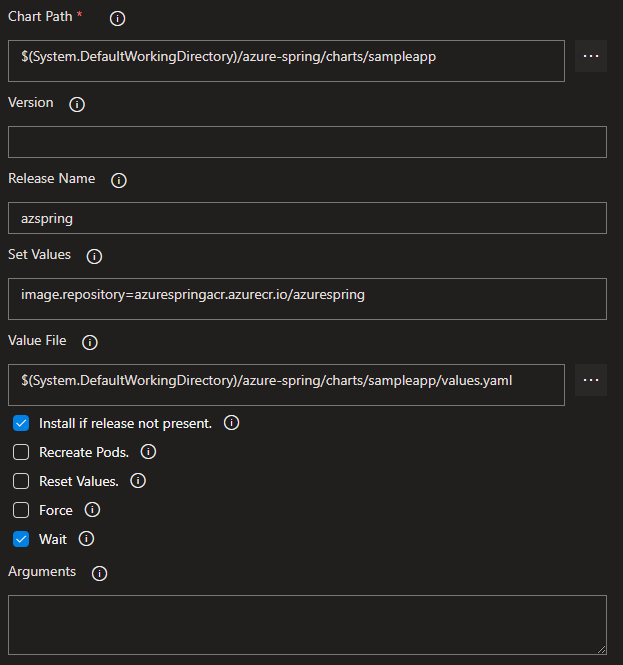
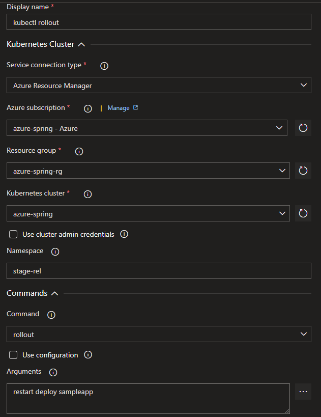
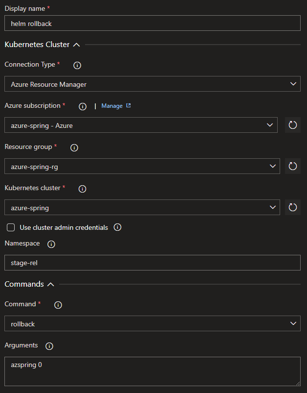

# Release 파이프라인(Classic)

배포 Manifest의 통합관리와 롤백의 용이성을 위해 Helm Chart를 사용하여 배포 파이프라인을 구성함. 또한 Azure DevOps Board내에서 릴리즈 추적성을 유지하기 위해 yaml방식의 파이프라인을 [Release 파이프라인(Classic)](https://docs.microsoft.com/ko-kr/azure/devops/pipelines/release/?view=azure-devops)으로 변경하여 사용함.

## [CI Pipeline yaml](https://github.com/HakjunMIN/azure-petclinic#azure-pipeline-%EA%B5%AC%EC%84%B1) 변경

### 이미지 배포

버전 태깅으로 Continuous Deployment를 수행하기 위해 태깅으로 Docker이미지를 레지스트리에 배포함.

```yaml
    - task: Docker@2
      displayName: Build and push an image to container registry
      condition: OR(contains(variables['build.sourceBranch'], 'RC'), contains(variables['build.sourceBranch'], 'RELEASE')) # 태그사용시에만 Trigger
      inputs:
        command: buildAndPush
        repository: $(imageRepository)
        dockerfile: $(dockerfilePath)
        containerRegistry: $(dockerRegistryServiceConnection)
        tags: |
          $(build.sourceBranchName)  # 태그 
```

### Helm Chart내에서 위 이미지 버전을 사용하도록 변경

bash 스크립트로 `values.yaml` 내 image tag값 변경

```yaml
    - task: Bash@3
      condition: OR(contains(variables['build.sourceBranch'], 'RC'), contains(variables['build.sourceBranch'], 'RELEASE'))
      inputs: 
        targetType: inline
        script: "sed -i 's/tag:.*/tag: $(build.sourceBranchName)/g' Application/charts/*/values.yaml"
```

### 차트 업로드

Release파이프라인에서 사용하기 위한 차트를 아티팩트로 업로드함.

```yaml
    - task: PublishPipelineArtifact@1
      condition: OR(contains(variables['build.sourceBranch'], 'RC'), contains(variables['build.sourceBranch'], 'RELEASE'))
      inputs:
        targetPath: 'Application/charts'
        artifact: charts
```

## Release 파이프라인 사용

Deploy와 Rollback을 별개의 Stage로 구성하고 Rollback은 필요시에만 사용할 수 있도록 함



### Azure Devops - Pipelines - Releases 메뉴에서 `New Release Pipeline`

### Artifacts



* `Default version`을 `Latest from the build default branch with tags`로 변경
* Tags에 특정 태그에 의해서만 Triggering되도록 `*RC*`, `*RELEASE*`를 입력.

* `Continuous Deployment Trigger`를 enabled해야함.



### Deploy Stage

* Deploy Task는 아래와 같이 이루어짐



> Helm 은 '22/03 기준 최신 버전인 `3.8.0`사용

* Helm upgrade

Cluster, Namespace, Command, Release Name, Vaule File등을 입력. Set Value 값은 values.yaml 파일의 특정 내용을 Override할 때 사용.




* kubectl rollout
pod를 rollout 방식으로 반영. (helm 의 recreate pod 기능이 deprecate됨)



### Rollback Stage

* Rollback Task는 아래와 같이 이루어짐



* Helm rollback

Command는 `rollback`, Argument는 `릴리즈명 0` 으로 입력. `0`은 바로 이전 Chart revision을 의미함.
